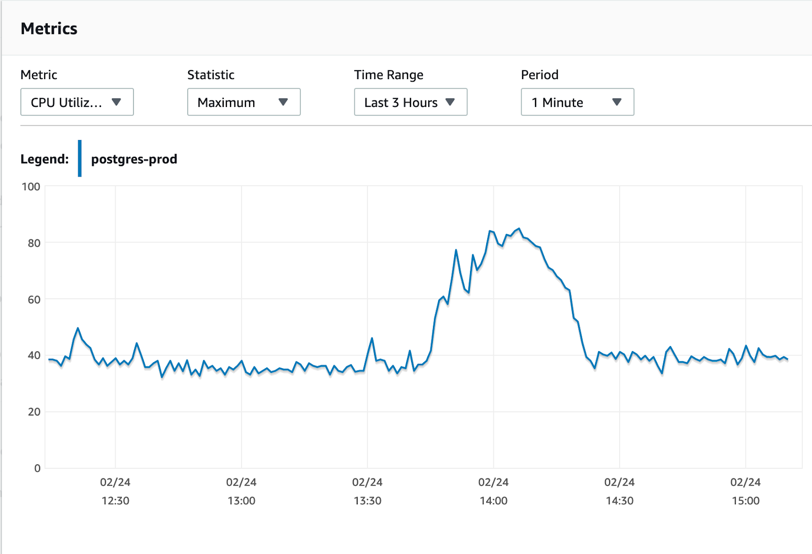
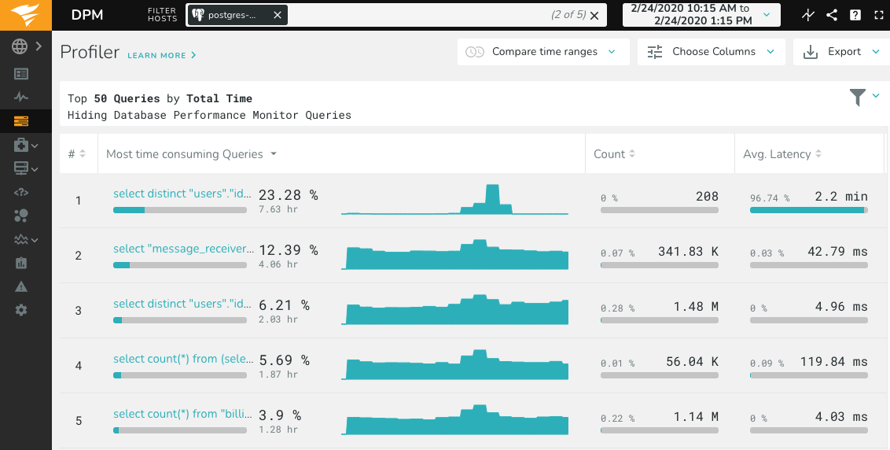

This is a story about a production issue we had at [brightwheel](https://mybrightwheel.com) (aka
`$work`) that was interesting enough to motivate me to blog about! Ultimately, there were four root
causes that worked in concert to cause the issue. This post will explain all four, and the Postgres
one is the meatiest.

Disclaimer: As far as Postgres goes, I'm no expert. If you know things about Postgres, you might not
find this particularly interesting. In fact, the title may have already given it away!

Over the past four years at brightwheel, I've continuously found myself in over my head.
"Continuously" not because Postgres is impossible to learn (the docs are actually excellent), but
because the scale we use it at has continued to grow, as well as the number of different ways we use
it. To give you a sense of scale, our main Postgres database is a couple terabytes of data.

---

On a normal Monday afternoon in February 2020, we got paged: high CPU utilization on our primary
database. Here's the:

<figure class="img-box">
  
  <figcaption class="caption">
    Postgres CPU utilization, elevating from 40% to 80% for about 30 minutes.
  </figcaption>
</figure>

Using [VividCortex](https://www.solarwinds.com/database-performance-monitor) (aka "SolarWinds
Database Performance Monitor"), there was an immediately obvious suspect - a new query that was
taking an average of over 2 minutes to complete, and was our #1 most time-consuming query:

<figure class="img-box">
  
  <figcaption class="caption">
    Top 5 most time-consuming queries during the 
  </figcaption>
</figure>

Here's the essence of the query:

```
SELECT DISTINCT
  users.id,
  users.first_name,
  users.last_name,
  users.is_demo_user
FROM users
INNER JOIN user_infos ON              users.id = user_infos.user_id
INNER JOIN user_prefs ON              users.id = user_prefs.user_id
LEFT OUTER JOIN auth_methods ON       users.id = auth_methods.user_id
LEFT OUTER JOIN profile_pics ON       users.id = profile_pics.user_id
LEFT OUTER JOIN user_roles ON         users.id = user_roles.user_id
LEFT OUTER JOIN billing_stats ON      users.id = billing_stats.user_id
LEFT OUTER JOIN user_payment_infos ON users.id = user_payment_infos.user_id
LEFT OUTER JOIN user_schools ON       users.id = user_schools.user_id
LEFT OUTER JOIN user_rooms ON         users.id = user_rooms.user_id
LEFT OUTER JOIN rooms ON              rooms.id = user_rooms.room_id
WHERE
  user_schools.school_id = 123
  AND user_infos.status = 'Active'
  AND billing_stats.active = TRUE
ORDER BY
  users.is_demo_user ASC,
  users.first_name ASC,
  users.last_name ASC
LIMIT 25
OFFSET 0
```

Essentially, this query returns a list of 25 students for a page in our web application. A few more
pieces of information to round out the puzzle:

- All of the `JOIN`s are joining from one indexed column to another
- All of the `WHERE` conditions use indexed columns
- The API endpoint responsible for this query was only _sometimes_ running this monstrous query and
  timing out
- No recent changes have been made to the implicated API endpoint
- No recent dependency changes

Given that, probably the most interesting thing about this query is that we are doing a lot of
`LEFT OUTER JOIN`s, but **not actually doing anything** with the tables we're joining to!

For example, why go through the trouble of joining to `profile_pics`, but then not selecting,
filtering, or ordering by any columns on `profile_pics`? Since a `LEFT OUTER JOIN` does **NOT**
exclude a given user if a corresponding profile pic isn't found, it seems like we're doing wasted
work!

Another interesting thing to note is that if we run an
[`EXPLAIN`](https://www.postgresql.org/docs/current/sql-explain.html) on the query, Postgres tells
us that it's doing a sequence scan on `users`, which means that it goes and reads millions of rows
one-by-one

Since installed Margailna
